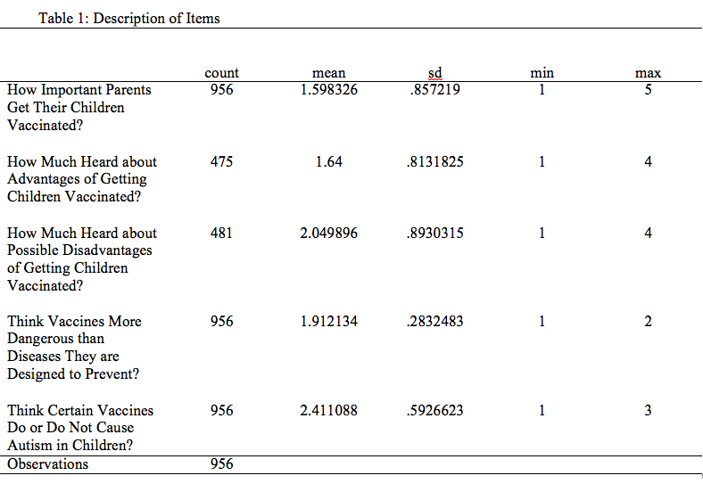
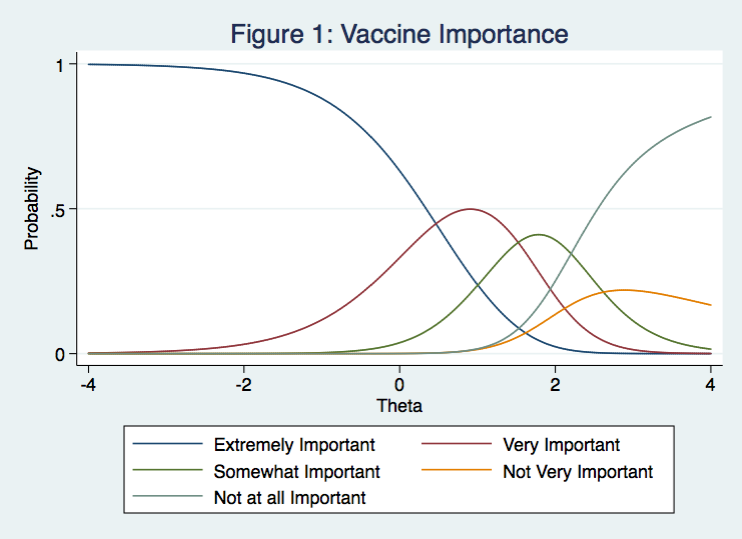
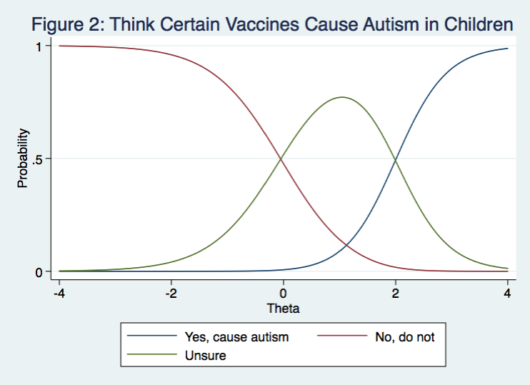
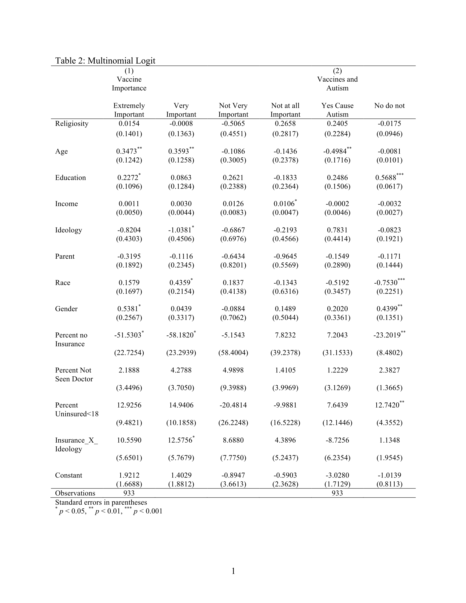

####Introduction:

Resistance to vaccination has existed since vaccination regimens were first administered. During the last several years, opposition to vaccination has been motivated by perceived links to autism. Although links between vaccinations and autism have been refuted, citizens are still concerned. I argue that there are three reasons that should motivate political scientists to explore anti-vaccination sentiments.  

First, prominent political figures voiced concerns about links between vaccinations and autism. President Trump, along with Republican candidates Ben Carson and Rand Paul, claimed the current vaccination regimens are linked to autism in the Republican Presidential Debate. Concerns about vaccinations are also voiced by Democratic politicians. Dennis Kucinich, a former US congressman and gubernatorial candidate, argued that parents should determine if their children should get vaccinated. Since voters look to politicians for informational shortcuts, anti-vaccination sentiments have political consequences (Lupia 1994, Lau & Redlawsk 2001).   

Second, interest groups defending vaccine freedom have become more prominent. Vaccine freedom groups are active in both Republican and Democratic stronghold states. For example, the Michigan Vaccine Freedom Political Action Committee has endorsed candidates on all major ballots during the 2018 midterm elections. Interestingly, Michigan Vaccine Freedom PAC endorsed Republicans, Democrats, and Independents. Scholars have posited that interest groups can influence the political agenda (Baumgartner & Jones 1991). The fact that interest groups are advocating policy premised on skepticism towards vaccinations should drive scholars to explore anti-vaccination sentiments.  

Third, citizens that vote in democracies should be informed. We know that levels of political knowledge are concerning in the United States (Delli Carpini and Keeter 1996). However, information that leads to concerns about vaccination is not necessarily linked to voter ignorance. While there has been media coverage that refutes links between vaccinations and autism, misconceptions persist. Perhaps evidence of Nyhan and Reifler (2010)’s failure of corrections, media coverage of vaccinations has not eased concern even after measles and mumps outbreaks. Therefore, scholars should explore variations that lead to increased skepticism toward vaccinations. 

This article departs from the third motivation for exploring anti-vaccination sentiments. Using a survey of 1000 adults in 50 states, I examine responses to a series of questions that capture anti-vaccination attitudes. First, I proceed to show the existence of anti-vaccination attitudes as a latent construct. I use both graded and nominal response models to show the presence of the latent construct. Then, I incorporate covariates that predict responses to direct questions on concerns about vaccinations. I use a multinomial logit model to predict the probability of particular responses. Finally, I show that individual and state-level covariates predict the parameter of anti-vaccination attitudes. Here, I use a mixed linear model with random coefficients and link the model to the theta parameter in the item response model. 

####Informational, Ideological, and Recent Perspectives on Anti-Vaccination Attitudes:

Concerns about vaccination have been studied extensively by scholars in public health and behavioral sciences.  Much of the literature focuses on the sources of information reported by survey respondents. The works underscore the importance of background factors and sources of information in the Theory of Planned Behavior (TPB). The Theory of Planned behavior is a cognitive processing model that links attitudes to behavioral intentions. Attitudes are determined by knowledge, behavioral beliefs, and subjective norms. Kennedy et al. (2011) ask respondents whether they plan on having their children follow recommended vaccine regimens. Surveying 475 individuals, Kennedy et al. show that 93.4 percent of the respondents plan to follow recommended vaccination regimens. In their sample, 81.7 percent of the respondents listed their doctor as the most important source of information on vaccines. Wheeler and Buttenheim (2013) also focus on sources of information on vaccines. They find that non-physician sources of information play an important role in parents’ intention to follow alternative immunization regimens. Wheeler and Buttenheim argue that communication from physicians plays an important role in addressing vaccine concerns. Salmon et al. (2004) mail surveys to a sample of 1000 schools in Colorado. Salmon et al. find that children attending schools with a respondent that was a registered nurse were less likely to have vaccine exemptions than children attending school where the respondent was not a nurse. 

Another line of literature emphasizes ideology and argues against the “knowledge deficit” approach. Baumgaertner et al. (2018) show that ideology has direct effects on anti-vaccination attitudes. Baumgaertner et al. find that conservative respondents are less likely to hold pro-vaccination attitudes. In work that emphasizes the role of ideology, political ideology is defined as a set of beliefs that influences an individual’s perception of normative order in society (Douglas & Wildavsky 1982, Baumgaertner et al. 2018). The literature on ideology also links ideology to cognitive decisions and evaluation of risk. Therefore, there is an expectation for ideology to influence attitudes towards vaccinations directly. 

####Testing the Knowledge Hypothesis with State Level Variation: 

I argue that there is an indirect relationship between health policy and anti-vaccination attitudes. More specifically, I predict that individuals from states that facilitate more interaction with medical professionals will be less likely to hold anti-vaccination attitudes. The relationship between health policy and attitudes is premised on knowledge deficit theory which explains anti-vaccination attitudes. Knowledge based theories emphasize interaction with medical professionals as reliable sources of information. States that have health policy that facilitates more interaction should be expected to have individuals that are less likely to be skeptical towards vaccines. While interaction with doctors is primarily determined by the behavior of individuals, state health care policy may be designed to facilitate more interaction with medical professionals. By state health care policy, I am referring to the determinants of health insurance enrollment. I use data from the Kaiser Family Institute to account for state level variation in citizen interaction with medical doctors and health insurance coverage. The data is merged with individual level data from the 2015 Pew Center Survey. 

When studying anti-vaccination attitudes, the primary concern is with the individuals. However, Salmon et al. (2004) show that variation at the group level, in their case the school level, leads to variation at the individual respondent level. Salmon et al. show that the presence of registered school nurses is associated with less rejection of physician recommended vaccine regimens. Available data allows for an assessment of the state-level background factors. Previous work has shown that information from medical professionals leads to less skepticism towards vaccines (Wheeler and Buttenheim 2013). I test whether factors lead to more access to medical professionals can be linked to anti-vaccination attitudes. I look at, both, the percent of individuals that had not seen doctors in over a year and the percent of uninsured individuals in a state. We may know the percent in the state that have not seen doctors. However, we can not be sure whether this is the case because of access to doctors or merely due to the behavior of an individual. Looking at the percent uninsured in a state reflects more policy variation. Therefore, I hypothesize that: 
	
- H1: Individuals from states with less interaction with medical professionals are more likely to hold anti-vaccination attitudes. 

- H2: Individuals from states with higher uninsured populations are more likely to have anti-vaccination attitudes. 

 

####Anti-Vaccination Attitudes in the Pew Center Survey:

                     [Insert Table 1 here] 

I show that, in the 2015 Pew Center Survey, there is evidence of the existence of anti-vaccination attitudes. My work differs from previous work because I treat anti-vaccination attitudes as latent constructs, measuring them using item response theory. I argue that measuring attitudes as latent constructs is superior to previous approaches because it uses responses to a range of questions. I proceed by looking at a collection of questions relevant to vaccination and concerns about side effects. In addition to collecting the demographics of the survey participants, the survey asks five direct questions about vaccinations. First, the survey asks about the importance of vaccinations. Second, the survey asks how much information a respondent heard about the advantages of vaccinations. Third, respondents are asked about exposure to information about the disadvantages of vaccinations. Fourth, respondents are asked if the vaccinations are more dangerous than the diseases they are designed to prevent. Fifth, the survey asks respondents if they think certain vaccines cause autism. The responses are coded as ordinal ranging from, for example, “Not at all important” to “Extremely Important.” 

To establish a relationship between questions or to uncover a latent construct, I employ item response models because of the nature of the questions and responses. I do not use additive models because these models treat each question with equal weight. Moreover, additive models do not reflect measures of uncertainty (Warshaw 2018). I do not use factor analysis models because they are not well suited for dichotomous and ordinal responses (Kaplan 2004, Treier & Hillygus 2009). Item response models are the most appropriate models for ordinal and nominal responses (Johnson and Albert 2006). Given that models taken from item response theory are the most appropriate, I employ both a graded response model and a nominal response model. 

#####Categorical Item Response Models:

To test for the existence of a latent construct from responses to the five major questions, I use a graded response model and a nominal response model. Both models calculate difficulty and discrimination parameters given responses to survey questions. The graded response model is an extension of a standard two parameter item response model. Graded response models are unique because they allow items to vary in their discriminations and difficulty parameters. The responses to the five questions are ordered. Assume the order is from 0 to k. The following equation illustrates how the model determines the probability of a particular response: 

$$Pr(Y_{ij} \ge k|\alpha_{i},\beta{i},\theta_{j})= \frac{exp(\alpha_{i}\theta_{j} - \beta_{ik})} {1 + exp(\alpha_{i}\theta_{j} - \beta_{ik})}$$

where alpha is the discrimination parameter for a particular item. Beta represents the cut point k between each response. Theta is the latent trait for a particular person j. Graded response models calculate the probability of observing outcome k or ones greater. 
	In nominal response models, the same logic is extended to non-ordered categorical items. Nominal models also allow each item to vary in difficulty and parameter. The model, proposed by Bock (1972), is helpful because it allows the prediction of each particular response. The following equation illustrates the probability of an individual person j selecting a particular category k for each item i. 

$$Pr(Y_{ij}= k | \alpha_{i},\beta_{i},\theta) = \frac{exp(\alpha_{ik}\theta_{j}+\beta_{ik})} {\sum_{h=1}^{K} exp(\alpha_{ih}\theta_{j}+\beta_{ih})}$$

#####Model Results and Interpretation:

For the item response models, I drop the respondents that did not answer the questions in Table 1. After fitting both a graded response model and a nominal response model, I find that there is evidence for the existence of a meaningful latent trait for three questions. The three questions are: (1) How important is it for parents to vaccinate their children? (2) Do certain vaccines cause autism in children? (3) Do you think vaccines are more dangerous than the disease they are designed to prevent? The graded response model yields a non-zero discrimination parameter that is statistically significant for the three questions. The nominal response model reports statistically significant differences between responses that are skeptical and not skeptical of vaccines. For example, there is a statistically significant difference between the responses that vaccination is “Extremely Important” and “Not Very Important.” The results are included in Table 1 of the appendix. 

Beyond the models’ results, Jackman (2008) recommends discussing reliability and validity. Regarding reliability, the models report measures of uncertainty that are below conventional measures. I argue that the models measured “what they are supposed to be measuring.” Especially in the ordered, graded response model, the distinction between high and lower ordered responses captures a skepticism of vaccination. The importance of vaccination and perception of links with autism are both loaded questions that capture the attitudes of individuals towards vaccination. Therefore, I am not worried about multidimensionality. To test the unidimensionality assumption, I used factor analysis and found that, once accounting for the latent attitude, the questions yield one factor.

                     [Insert Figure 1 & 2 here]                       

Figures 1 and 2 are characteristic curves that show the role of theta in the probability of observing particular responses. Theta is the latent construct or attitude measure. For vaccine importance, Figure 1 shows that as theta increases the probability of responding “Extremely Important” decreases. When the “Extremely Important” line intersects with the red line, that value of theta yields a higher probability of responding “Very Important.” As theta increases respondents will be more likely to respond, “Somewhat Important.” Finally, a value of theta that continues to increase yields higher probability of responding “Not at all important.”

The role of theta is professing itself more in Figure 2. Here, respondents are asked whether certain vaccines cause autism. As theta increases the probability of responding “No” decreases. As theta increases, we encounter less certain respondents that were “Unsure” if vaccines cause autism. When the green line intersects with the blue line, for values of theta greater than 2, respondents are more likely to respond “Yes.” 

Taken together, the figures illustrate that the models are measuring what is intended for them to measure. As theta increases, the more likely the respondents hold anti-vaccination attitudes. In the following section, I predict responses to each of the two questions. After looking at predictions of raw responses, I predict theta. 
   
                     
####Multinomial Logit: 

In this section I discuss the results of models that directly predict responses. As opposed to looking at the theta parameter of the anti-vaccination attitude, I test how the covariates do in predicting raw responses. I use both individual and state level covariates in these models. After discussing the multinomial model presented, I discuss covariates in both models, and explain the results. I show that looking at the latent constructs is necessary because the covariates do not do well at predicting responses. 

To test individual level variables, I fit a multinomial logit model to predict individual responses. The multinomial model is clustered by state. The model tests both the importance of vaccinations and vaccinations and autism responses as the dependent variables. In this model, I incorporate state level variables. I use a multinomial model instead of an ordered logit. Ordered logit models do not allow clustering by state. 

	
#####Independent Variables:

I argue that states that facilitate frequent interaction between citizens and doctors should have less skepticism towards vaccination. If citizens get their information from doctors, they should be more likely to have less professed anti-vaccination concerns. In order to capture the conditions that facilitate frequent interaction between individuals and doctors, I include several state-level variables. State level data is taken from the Kaiser Family Foundation dataset on health care. State level variables are from 2014, a year before the survey was conducted. The first state-level variable is percent of adults that have not seen a doctor in the past twelve months. The second variable is a measure of the percent of uninsured individuals by state. 

I also use individual level data that was collected during the survey. I use an ideology variable to test competing hypotheses about anti-vaccination sentiments. The ideology variable is an ordered variable that ranges from very conservative to very liberal. Baum (2011) argues that anti-vaccination opinions are shaped by ideology. Although Baum was looking at H1N1 vaccines, there is still reason to believe that the logic applies to the claims made in this article. 
 

#####Controls:

At the individual level, I control for seven variables. I control for religiosity to account for variation explained by religious belief. States allow exemptions from vaccination for religious reasons. Therefore, religious concerns are expected to influence attitudes towards vaccinations. The religiosity variable is measured by church attendance.  I include age to account for a generational differences between respondents. The variable is ordinal and is broken into ten year intervals. I include education to account for variation in knowledge that results from differences in formal education. The variable is ordinal and measures whether respondents completed high school, some college, college, or post graduate degrees. There is reason to believe that differences in income may allow more access to reliable information or alternate information. Income is measured as monthly household income. I include a dichotomous variable that indicates for whether the respondent was a parent. I include gender and race to account for demographic and other distinctions between respondents. A respondent is a male if the gender variable equals 1.  Race is measured as a dichotomous variable and equals 1 when the respondent is white. 

At the state level I include a control that accounts for the percent of children that are uninsured. The control is necessary to separate the state policy implications. Children are insured under federal mandates. If they are not separate from the percent uninsured variable it would be will be misleading. I include an interaction between percent health insurance coverage and individual ideology. I include this variable because I use a multilevel modelling in Table 3. Therefore, it is included in both models so they are consistent. 
 

                     [Insert Table 2 here]

#####Results:

The results are presented in Table 2. The omitted response is the baseline category for each model. Model 1 uses the question about the importance of vaccinations as the dependent variable. Model 2 uses perception of links to autism as the dependent variable. Based on the results, there is no evidence for any of the variables having a consistent effect on vaccine skepticism.  Consistency would require that variables predict a higher likelihood of finding vaccines not important and expressing worry about links to autism. In both models, particular variables may predict a response but not a consistent attitude. The results illustrate the limits of looking at direct responses and not using item response models. 

                     [Insert Table 3 here]

####Item Response Models:

More meaningful results are observed using item response models.  In the previous model, I predicted responses to each question. Here, I will predict the value of theta, conditional on the covariates. I use a mixed linear model and group respondents according to states. The dependent variable is the predicted value of theta for each respondent. I find no statistically significant relationship between the percent of individuals that have seen doctors and anti-vaccination attitudes. I find, all else equal, that higher values of theta are associated with individuals from states with higher uninsured populations. Therefore, the results only confirm my second hypothesis. 

There seems to be a link between state health care policy and anti-vaccination attitudes. I predicted that the link operates through interaction with doctors. However, the variable that measures interaction with doctors is not statistically significant. Given the controls that are included at the individual-level the results still suggest that there is more evidence for the knowledge deficit theory than ideology. The results also indicate that, all else equal, more educated respondents have lower skepticism towards vaccination. Also, white respondents are more likely to have higher skepticism.  Men are less likely to have skepticism towards vaccination. However, these results are not theorized in this article.    
 

####Conclusion: 

Although anti-vaccination sentiments receive coverage in the news, social scientist have not studied them extensively. The medical community agrees that there is no evidence that links childhood vaccination regimens to autism. However, politicians and interest groups act based on misconception. In this article, I show that anti-vaccinations sentiments are more prevalent in states where individuals have less interaction with medical professionals. 

I argue against claims that attribute anti-vaccination sentiments to ideology. Beyond the fact that politicians on both sides of the ideological spectrum have raised these concerns, I show that there is no evidence of effects of ideology in the 2015 survey. I argue in favor of the knowledge deficit hypothesis. My findings expand on work that finds that more reliable sources of information lead to less skepticism towards vaccination.

Future research should begin by gathering more data on anti-vaccination sentiments. With individual-level data on interaction with doctors, I could have more evidence to test the link between health policy and anti-vaccination attitudes.  Also, the effects of measles and mumps outbreaks on public opinion is not clear. With more data across different points in time, scholars may be able to identify the effects outbreaks as information shocks. 
 

******

####Tables and Figures

******

####References

Baum, M. A. 2011. “Red State, Blue State, Flu State: Media Self-Selection and Partisan Gaps in Swine Flu Vaccinations” J Health Polit Policy Law. 36 (6): 1021-1059. 

Baumgartner, F. R., and B. D. Jones. 1991. “Agenda Dynamics and Policy Subsystems.” Journal of Politics 53: 1044: 1074.

Bock, R.D. (1972). Estimating item parameters and latent ability when responses are scored in two or more nominal categories. Psychometrika 37, 29–51.

Delli Carpini, Michael X. and Scott Keeter. 1996. What Americans Know about Politics and Why it Matters. Yale University Press.

Jackman, S. 2008. “Measurement.” In The Oxford Handbook of Political Methodology.

Johnson, V. E., and J. H. Albert. 2006. Ordinal Data Modeling. New York, NY: Springer Science & Business Media.

Kaplan, D. 2004. The Sage Handbook of Quantitative Methodology for the Social Sciences. Thousand Oaks, CA: Sage Publications Inc.

Kennedy A., K. Lavail, G Nowak , M Basket, and S. Laundry. 2011. “Confidence about vaccines in the United States: understanding parents' perceptions.” Health Affairs 30 (6): 1151-9. 

Lau, R.  R. and D. P. Redlawsk. 2001. “Advantages and Disadvantages of Cognitive Heuristics in Political Decision Making.” American Journal of Political Science 45 (4): 951-971.

Lupia, A. 1994. “Shortcuts versus Encyclopedias: Information and Voting Behavior in California Insurance Reform Elections.” American Political Science Review 88(1): 63-76.

Nyhan, Brendan and Jason Reifler. 2010. “When Corrections Fail: The Persistence of Political Misperceptions.” Political Behavior 32: 303-330.

Treier, S., and D. S. Hillygus. 2009. “The Nature of Political Ideology in the Contemporary Electorate.” Public Opinion Quarterly 73 (4): 679–703.

Salmon D. A., L. H. Moulton, S. B. Omer, L . M. Chase, A. Klassen, P. Talebian, N. A. Halsey. 2004. “Knowledge, attitudes, and beliefs of school nurses and personnel and associations with nonmedical immunization exemptions.” Pediatrics. 113 (6): 552-9. 

Warshaw, C. 2018. “Latent Constructs in Public Opinion” in The Oxford Handbook of Polling and Survey Methods.

******

####Appendix

## Citations

#Zotero 

@mulligan2011

